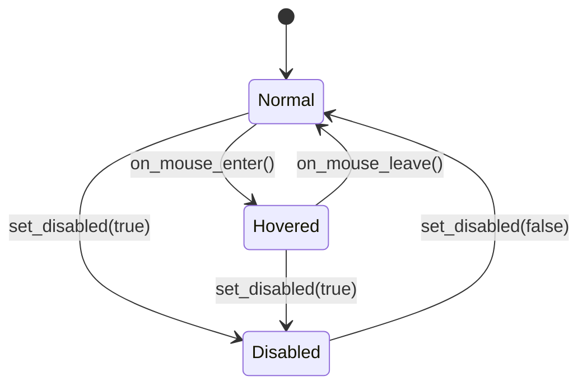

# API Reference

This document covers the full public API of zketch v1.0. All headers are under `include/zk/`.

---

## Table of Contents

- [zk::core — Application and Message Loop](#zkcore)
- [zk::ui — Widgets](#zkui)
- [zk::render — Renderer](#zkrender)
- [zk::event — Event System](#zkevent)
- [zk::metric — Coordinate Types](#zkmetric)
- [zk::error — Error Handling](#zkerror)
- [zk::log — Logging](#zklog)
- [zk::io — Serialization and Deserialization](#zkio)
- [zk::util — Utilities](#zkutil)

---

## zk::core

Header: `zk/core/application.hpp`, `zk/core/message_loop.hpp`, `zk/core/main_thread_queue.hpp`

### PumpMode

```cpp
enum class PumpMode : uint8_t {
    NonBlocking,  // PeekMessage — runs every frame (game loops)
    Blocking,     // GetMessage  — sleeps when idle (desktop apps)
};
```

### Application

Single entry point for the framework. Move-only.

```cpp
class Application {
public:
    // Factory — the only way to construct a valid Application.
    // Registers a Win32 WNDCLASSEX with the given class_name.
    // Returns an error if registration fails.
    [[nodiscard]] static std::expected<Application, error::Error> create(
        std::string_view class_name,
        PumpMode         mode = PumpMode::Blocking) noexcept;

    // Registers a callback invoked once per frame in NonBlocking mode.
    // Has no effect in Blocking mode.
    void set_frame_callback(std::function<void()> cb) noexcept;

    // Registers a callback invoked when the message loop encounters an error.
    void set_error_handler(std::function<void(const error::Error&)> handler) noexcept;

    // Starts the message loop. Blocks until WM_QUIT is received.
    // Returns the WM_QUIT exit code, or an error on failure.
    [[nodiscard]] std::expected<int, error::Error> run() noexcept;

    // Queries
    [[nodiscard]] PumpMode           mode()       const noexcept;
    [[nodiscard]] const std::string& class_name() const noexcept;
};
```

All operations must be called from the Main Thread. In debug builds a thread-id assertion fires if this contract is violated.

### MainThreadQueue

Thread-safe singleton queue for posting work to the main thread.

```cpp
class MainThreadQueue {
public:
    // Returns the process-wide singleton instance.
    [[nodiscard]] static MainThreadQueue& instance() noexcept;

    // Post a callable from any thread. It will be executed on the main thread
    // during the next flush() call. Safe to call from any thread.
    void post(std::function<void()> fn);

    // Execute all pending callables in FIFO order.
    // Must be called from the Main Thread only.
    // The queue is drained atomically before any callable is invoked,
    // so items posted during flush are deferred to the next cycle.
    void flush() noexcept;
};
```

---

## zk::ui

Header: `zk/ui/window.hpp`, `zk/ui/panel.hpp`, `zk/ui/label.hpp`, `zk/ui/button.hpp`, `zk/ui/widget_base.hpp`, `zk/ui/color.hpp`, `zk/ui/font_config.hpp`

### Color

```cpp
struct Color {
    uint8_t r{0};
    uint8_t g{0};
    uint8_t b{0};
    uint8_t a{255};

    constexpr bool operator==(const Color&) const noexcept = default;
};
```

Predefined constants in `zk::ui::colors`:

```cpp
namespace zk::ui::colors {
    inline constexpr Color Black       { 0,   0,   0,   255 };
    inline constexpr Color White       { 255, 255, 255, 255 };
    inline constexpr Color Red         { 255, 0,   0,   255 };
    inline constexpr Color Green       { 0,   255, 0,   255 };
    inline constexpr Color Blue        { 0,   0,   255, 255 };
    inline constexpr Color Yellow      { 255, 255, 0,   255 };
    inline constexpr Color Cyan        { 0,   255, 255, 255 };
    inline constexpr Color Magenta     { 255, 0,   255, 255 };
    inline constexpr Color Transparent { 0,   0,   0,   0   };
    inline constexpr Color Gray        { 128, 128, 128, 255 };
    inline constexpr Color LightGray   { 211, 211, 211, 255 };
    inline constexpr Color DarkGray    { 64,  64,  64,  255 };
}
```

### FontConfig

```cpp
struct FontConfig {
    std::string family  = "Segoe UI";  // Font family name (UTF-8)
    float       size_pt = 12.0f;       // Font size in points
    bool        bold    = false;
    bool        italic  = false;

    constexpr bool operator==(const FontConfig&) const noexcept = default;
};
```

### WidgetBase

Abstract base class for all widgets. Non-copyable; movable.

```cpp
class WidgetBase {
public:
    // Position (relative to parent)
    [[nodiscard]] metric::Pos<int>       pos()  const noexcept;
    [[nodiscard]] metric::Size<uint16_t> size() const noexcept;

    void set_pos(metric::Pos<int> pos) noexcept;        // marks dirty
    void set_size(metric::Size<uint16_t> size) noexcept; // marks dirty

    // Visibility
    [[nodiscard]] bool is_visible() const noexcept;
    void set_visible(bool visible) noexcept;  // marks dirty

    // Dirty flag — set when the widget needs to be redrawn
    [[nodiscard]] bool is_dirty() const noexcept;
    void mark_dirty()  noexcept;
    void clear_dirty() noexcept;

    // Render interface — implemented by each concrete widget
    virtual void render(render::Renderer& renderer) = 0;

    virtual ~WidgetBase() noexcept = default;
};
```

### Window

Top-level Win32 window. Move-only.

```cpp
class Window {
public:
    // Factory — creates a Win32 window via CreateWindowEx.
    // If size.w == 0 || size.h == 0, defaults to 800x600.
    [[nodiscard]] static std::expected<Window, error::Error> create(
        std::string_view        title,
        metric::Pos<int>        pos  = { CW_USEDEFAULT, CW_USEDEFAULT },
        metric::Size<uint16_t>  size = { 0, 0 }
    ) noexcept;

    // Deserialization factory — constructs a Window without a real HWND.
    // Intended for use by WidgetParser only.
    [[nodiscard]] static Window create_from_config(
        std::string_view       title,
        metric::Pos<int>       pos,
        metric::Size<uint16_t> size) noexcept;

    // Visibility
    void show()     noexcept;  // SW_SHOW; initialises renderer on first call
    void hide()     noexcept;  // SW_HIDE
    void minimize() noexcept;  // SW_MINIMIZE
    void maximize() noexcept;  // SW_MAXIMIZE

    // Child management — transfers ownership into the Window.
    // Returns a non-owning reference to the added panel.
    Panel& add_panel(std::unique_ptr<Panel> panel);

    // Event registration
    void on_resize  (std::function<void(metric::Size<uint16_t>)> handler);
    void on_close   (std::function<void()> handler);
    void on_key_down(std::function<void(uint32_t vkey)> handler);
    void on_key_up  (std::function<void(uint32_t vkey)> handler);

    // Accessors
    [[nodiscard]] const std::string&       title()         const noexcept;
    [[nodiscard]] metric::Pos<int>         pos()           const noexcept;
    [[nodiscard]] metric::Size<uint16_t>   size()          const noexcept;
    [[nodiscard]] bool                     is_valid()      const noexcept;

    // Returns the underlying HWND for advanced Win32 usage.
    // WARNING: Manipulating the HWND directly can violate framework invariants.
    [[nodiscard]] HWND native_handle() const noexcept;

    // Returns a pointer to the renderer, or nullptr if not yet initialised.
    [[nodiscard]] render::Renderer* renderer() noexcept;

    // Read-only view of top-level panels (used by WidgetSerializer).
    [[nodiscard]] const std::vector<std::unique_ptr<Panel>>& panels() const noexcept;
};
```

### Panel

Rectangular container widget. Move-only.

```cpp
class Panel : public WidgetBase {
public:
    Panel(metric::Pos<int>       pos,
          metric::Size<uint16_t> size) noexcept;

    // Absolute screen position (derived from parent + relative pos)
    [[nodiscard]] metric::Pos<int> abs_pos() const noexcept;

    // Sets relative position and recursively updates all children's abs_pos.
    void set_pos(metric::Pos<int> new_pos) noexcept;

    // Called by a parent Panel to propagate a new absolute origin.
    void set_abs_origin(metric::Pos<int> parent_abs_pos) noexcept;

    // Child management — transfers unique ownership into the Panel.
    void add_child(std::unique_ptr<WidgetBase> child);

    // Releases ownership of child back to the caller.
    // Returns nullptr if child is not found.
    [[nodiscard]] std::unique_ptr<WidgetBase> remove_child(WidgetBase* child);

    // Read-only view of children.
    [[nodiscard]] const std::vector<std::unique_ptr<WidgetBase>>& children() const noexcept;

    // Returns the original relative position of the child at index.
    // Used by WidgetSerializer for round-trip-stable output.
    [[nodiscard]] metric::Pos<int> child_rel_pos(std::size_t index) const noexcept;

    // Render
    void render(render::Renderer& renderer) override;
};
```

### Label

Static text widget.

```cpp
class Label : public WidgetBase {
public:
    Label(std::string_view        text,
          metric::Pos<int>        pos,
          metric::Size<uint16_t>  size);

    // Text
    [[nodiscard]] const std::string& text()  const noexcept;
    void set_text(std::string_view text);   // marks dirty

    // Font
    [[nodiscard]] const FontConfig& font() const noexcept;
    void set_font(const FontConfig& font); // marks dirty

    // Color
    [[nodiscard]] Color color() const noexcept;
    void set_color(Color color);           // marks dirty

    // Render
    void render(render::Renderer& renderer) override;
};
```

### Button

Interactive clickable widget.

```cpp
enum class ButtonState : uint8_t {
    Normal,
    Hovered,
    Disabled,
};

class Button : public WidgetBase {
public:
    Button(std::string_view        label,
           metric::Pos<int>        pos,
           metric::Size<uint16_t>  size);

    // Label text
    [[nodiscard]] const std::string& label() const noexcept;

    // Click handler — called when clicked and state != Disabled.
    // Passing an empty function clears the handler.
    void set_on_click(std::function<void()> handler);

    // Enable / disable
    // set_disabled(true)  → state becomes Disabled
    // set_disabled(false) → state becomes Normal
    void set_disabled(bool disabled);

    // State query
    [[nodiscard]] ButtonState state() const noexcept;

    // Internal event handlers — called by Window's WndProc
    void on_mouse_enter();
    void on_mouse_leave();
    void on_click();

    // Render
    void render(render::Renderer& renderer) override;
};
```

State transitions:



---

## zk::render

Header: `zk/render/renderer.hpp`

### Renderer

Direct2D-backed renderer for a single HWND. Move-only.

```cpp
class Renderer {
public:
    // Factory — initialises ID2D1Factory, ID2D1HwndRenderTarget, IDWriteFactory.
    [[nodiscard]] static std::expected<Renderer, error::Error> create(HWND hwnd) noexcept;

    // Frame lifecycle — must be called in this order each frame
    void begin_frame() noexcept;
    void end_frame()   noexcept;  // handles D2DERR_RECREATE_TARGET automatically

    // Draw primitives — must be called between begin_frame() and end_frame()
    void clear(ui::Color color) noexcept;

    void draw_rect(metric::Pos<int>        pos,
                   metric::Size<uint16_t>  size,
                   ui::Color               color) noexcept;

    void draw_text(std::string_view        text,
                   metric::Pos<int>        pos,
                   metric::Size<uint16_t>  clip_size,
                   const ui::FontConfig&   font,
                   ui::Color               color) noexcept;

    // State queries
    [[nodiscard]] bool is_valid()      const noexcept;  // true if render target is ready
    [[nodiscard]] bool needs_redraw()  const noexcept;  // true after target recreation
    void clear_redraw_flag() noexcept;
};
```

---

## zk::event

Header: `zk/event/event_dispatcher.hpp`, `zk/event/event_types.hpp`

### EventType and Payloads

```cpp
enum class EventType : uint32_t {
    Click,
    Resize,
    Close,
    KeyDown,
    KeyUp,
    MouseEnter,
    MouseLeave,
    _Count  // sentinel — do not use directly
};

struct ClickPayload      {};
struct ClosePayload      {};
struct MouseEnterPayload {};
struct MouseLeavePayload {};

struct ResizePayload {
    metric::Size<uint16_t> size;
};

struct KeyPayload {
    uint32_t vkey;  // Win32 virtual key code
};
```

### EventDispatcher

Non-copyable, movable.

```cpp
using HandlerId = uint32_t;  // zero is invalid

class EventDispatcher {
public:
    EventDispatcher() noexcept = default;

    // Subscribe a handler for the given event type.
    // Returns a HandlerId for later unsubscription.
    // Handlers are invoked in subscription order.
    // Must be called from the Main Thread.
    template <typename Payload>
    [[nodiscard]] HandlerId subscribe(
        EventType type,
        std::function<void(const Payload&)> handler);

    // Remove the handler identified by id from the given event type.
    // No-op if id is not found.
    // Must be called from the Main Thread.
    void unsubscribe(EventType type, HandlerId id) noexcept;

    // Dispatch an event to all registered handlers for the given type.
    // Exceptions thrown by handlers are caught, logged, and swallowed.
    // Must be called from the Main Thread.
    template <typename Payload>
    void dispatch(EventType type, const Payload& payload) noexcept;

    // Returns the number of handlers registered for type.
    [[nodiscard]] std::size_t handler_count(EventType type) const noexcept;
};
```

Usage:

```cpp
EventDispatcher disp;

auto id = disp.subscribe<ResizePayload>(EventType::Resize,
    [](const ResizePayload& p) {
        // p.size.w, p.size.h
    });

disp.dispatch(EventType::Resize, ResizePayload{ new_size });

disp.unsubscribe(EventType::Resize, id);
```

---

## zk::metric

Header: `zk/metric/pos.hpp`, `zk/metric/size.hpp`, `zk/metric/rect.hpp`, `zk/metric/basic_pair.hpp`

### Pos\<T\>

2D position. Values are clamped to `[-MAX, MAX]` on construction and after arithmetic. Supports CTAD.

```cpp
template <meta::Arithmetic T>
class Pos : public basic_pair<Pos<T>> {
public:
    T x{};
    T y{};

    static constexpr T MIN = -static_cast<T>(basic_pair<Pos<T>>::MAX);

    constexpr Pos() noexcept = default;
    constexpr Pos(T val) noexcept;           // x = y = clamp(val, MIN, MAX)
    constexpr Pos(T xval, T yval) noexcept;  // x = clamp(xval), y = clamp(yval)

    // Arithmetic operators: +, -, *, /, +=, -=, *=, /= (all clamped)
    // Comparison: operator<=> (strong ordering)
};

// CTAD: Pos{1, 2} → Pos<int>; Pos{1.0f, 2.0f} → Pos<float>
```

### Size\<T\>

2D dimensions. Values are clamped to `[0, MAX]` on construction and after arithmetic. Supports CTAD.

```cpp
template <meta::Arithmetic T>
class Size : public basic_pair<Size<T>> {
public:
    T w{};
    T h{};

    static constexpr T MIN = T{0};

    constexpr Size() noexcept = default;
    constexpr Size(T val) noexcept;           // w = h = clamp(val, 0, MAX)
    constexpr Size(T wval, T hval) noexcept;  // w = clamp(wval), h = clamp(hval)

    // Arithmetic operators: +, -, *, /, +=, -=, *=, /= (all clamped)
    // Comparison: operator<=> (strong ordering)
};

// CTAD: Size{800, 600} → Size<int>; Size{1.0f} → Size<float>
```

### Rect\<T\>

Flat rectangle.

```cpp
template <meta::Arithmetic T>
struct Rect {
    T x{}, y{}, w{}, h{};

    constexpr Rect(T xval, T yval, T wval, T hval) noexcept;

    [[nodiscard]] constexpr bool contains(T px, T py) const noexcept;
    [[nodiscard]] constexpr T    right()              const noexcept;  // x + w
    [[nodiscard]] constexpr T    bottom()             const noexcept;  // y + h
};
```

### basic_pair\<Derived\>

CRTP base providing arithmetic operators for `Pos` and `Size`.

```cpp
template <typename Derived>
class basic_pair {
public:
    static constexpr uint16_t MAX = 65535;  // ~uint16_t{0}

    // All operators (+, -, *, /, +=, -=, *=, /=) for same-type and scalar operands.
    // Results are clamped to [Derived::MIN, MAX].
};
```

---

## zk::error

Header: `zk/error/error.hpp`

### ErrorCode

```cpp
enum class ErrorCode : uint32_t {
    // Initialization
    InitFailed,
    WindowClassRegistrationFailed,
    // Window
    WindowCreationFailed,
    WindowInvalidState,
    // Rendering
    RenderTargetCreationFailed,
    RenderTargetLost,
    // Event
    EventHandlerException,
    // Parsing
    ParseError,
    // Thread safety
    WrongThread,
    // Generic
    Unknown,
};
```

### Error

```cpp
struct Error {
    ErrorCode   code;
    std::string message;
    uint32_t    native_error = 0;  // GetLastError() or HRESULT

    // Returns true for unrecoverable errors:
    // InitFailed, WindowClassRegistrationFailed, WindowCreationFailed,
    // RenderTargetCreationFailed, WrongThread
    bool is_fatal() const noexcept;

    // Returns a string_view describing the error code
    std::string_view to_string() const noexcept;
};
```

### Helpers

```cpp
// Construct an Error with the given code and message
Error make_error(ErrorCode code, std::string message, uint32_t native = 0);

// Construct an Error and capture GetLastError() into native_error
Error make_win32_error(ErrorCode code, std::string message);
```

---

## zk::log

Header: `zk/log/logger.hpp`

### Level and Domain

```cpp
enum class Level  : uint8_t { Trace, Debug, Info, Warn, Error, Fatal };
enum class Domain : uint8_t { Core, UI, Render, Event, IO, Parser };
```

### LogEntry

```cpp
struct LogEntry {
    Level            level;
    Domain           domain;
    std::string_view message;
    std::string_view file;
    int              line;
    uint64_t         timestamp_ns;
};
```

### Logger

Singleton. Access via `Logger::instance()`.

```cpp
class Logger {
public:
    static Logger& instance() noexcept;

    // Set the minimum level. Messages below this level are discarded.
    void set_min_level(Level level) noexcept;

    // Enable or disable a specific domain.
    void set_domain_filter(Domain domain, bool enabled) noexcept;

    // Add a sink. All enabled log entries are forwarded to every registered sink.
    void add_sink(std::function<void(const LogEntry&)> sink);

    // Reset all state to defaults. Intended for use in unit tests only.
    void reset() noexcept;

    // Log a message. If L is below the compile-time threshold, the call is
    // eliminated entirely by the optimizer.
    template <Level L, Domain D>
    void log(std::string_view msg, std::string_view file = {}, int line = 0) noexcept;
};
```

### ZK_LOG Macro

```cpp
ZK_LOG(level, domain, message)
// Expands to: Logger::instance().log<level, domain>(message, __FILE__, __LINE__)
```

Example:

```cpp
ZK_LOG(zk::log::Level::Info,  zk::log::Domain::Core,   "Application started");
ZK_LOG(zk::log::Level::Error, zk::log::Domain::Render, "Render target lost");
```

---

## zk::io

Header: `zk/io/widget_serializer.hpp`, `zk/io/widget_parser.hpp`

### Widget Config Format

The human-readable text format used for serialization. Example:

```
Window "main"
  pos: 100 100
  size: 800 600
  Panel "sidebar"
    pos: 0 0
    size: 200 600
    Label "title"
      pos: 10 10
      size: 180 30
      text: "Hello, zketch!"
      color: 0 0 0 255
    Button "ok_btn"
      pos: 10 50
      size: 80 30
      label: "OK"
```

Rules:
- Indentation is 2 spaces per nesting level.
- Lines starting with `#` are comments and are silently skipped.
- Empty lines are silently skipped.
- Quoted strings use `"..."`.

### WidgetSerializer

```cpp
class WidgetSerializer {
public:
    WidgetSerializer() noexcept = default;

    // Serialize the widget hierarchy rooted at root into a config format string.
    // The returned string always ends with a newline.
    [[nodiscard]] std::string serialize(const ui::Window& root) const;
};
```

### ParseError

```cpp
struct ParseError {
    int         line{0};    // 1-based line number
    int         column{0};  // 1-based column number
    std::string message;    // human-readable description
};
```

### WidgetParser

```cpp
class WidgetParser {
public:
    WidgetParser() noexcept = default;

    // Parse input and return the reconstructed Window hierarchy.
    // Returns a ParseError with line and column on malformed input.
    [[nodiscard]] std::expected<std::unique_ptr<ui::Window>, ParseError>
    parse(std::string_view input) const;
};
```

---

## zk::util

Header: `zk/util/native_wrapper.hpp`, `zk/util/enums.hpp`, `zk/util/arithmetic.hpp`, `zk/util/clamp.hpp`, `zk/util/arithmetic_op.hpp`

### NativeWrapper\<Handle, Deleter\>

RAII wrapper for Win32 handles. Move-only; copy is deleted.

```cpp
template <typename Handle, auto Deleter>
class NativeWrapper {
public:
    NativeWrapper() noexcept;
    explicit NativeWrapper(Handle h) noexcept;

    ~NativeWrapper() noexcept;  // calls Deleter(handle) if handle != nullptr

    NativeWrapper(NativeWrapper&&) noexcept;
    NativeWrapper& operator=(NativeWrapper&&) noexcept;

    Handle get()   const noexcept;
    bool   valid() const noexcept;
    explicit operator bool() const noexcept;
};

// Pre-defined alias
using HwndWrapper = NativeWrapper<HWND, &DestroyWindow>;
```

### to_string

`to_string()` overloads are provided for all framework `enum class` types:

```cpp
namespace zk::util {
    constexpr std::string_view to_string(error::ErrorCode)  noexcept;
    constexpr std::string_view to_string(log::Level)        noexcept;
    constexpr std::string_view to_string(log::Domain)       noexcept;
    constexpr std::string_view to_string(event::EventType)  noexcept;  // in event_types.hpp
    constexpr std::string_view to_string(ui::ButtonState)   noexcept;  // in button.hpp
    constexpr std::string_view to_string(core::PumpMode)    noexcept;  // in application.hpp
}
```

Note: `EventType`, `ButtonState`, and `PumpMode` overloads are defined in their respective headers to avoid cyclic dependencies.

### to_underlying

```cpp
namespace zk::util {
    // Explicit enum-to-numeric conversion
    template <typename E> requires std::is_enum_v<E>
    constexpr std::underlying_type_t<E> to_underlying(E e) noexcept;
}
```

### Arithmetic Concept

```cpp
namespace zk::meta {
    template <typename T>
    concept Arithmetic = std::is_arithmetic_v<T>;
}
```

### clamp

```cpp
namespace zk::util {
    // Clamps val to [lo, hi]
    template <meta::Arithmetic T>
    constexpr T clamp(T val, auto lo, auto hi) noexcept;
}
```

### arithmetic_op

```cpp
namespace zk::util {
    // Same-type overloads
    template <meta::Arithmetic T> constexpr T add(T a, T b) noexcept;
    template <meta::Arithmetic T> constexpr T sub(T a, T b) noexcept;
    template <meta::Arithmetic T> constexpr T mul(T a, T b) noexcept;
    template <meta::Arithmetic T> constexpr T div(T a, T b) noexcept;

    // Mixed-type overloads — return std::common_type_t<Ty, Tz>
    template <meta::Arithmetic Ty, meta::Arithmetic Tz> constexpr auto add(Ty a, Tz b) noexcept;
    template <meta::Arithmetic Ty, meta::Arithmetic Tz> constexpr auto sub(Ty a, Tz b) noexcept;
    template <meta::Arithmetic Ty, meta::Arithmetic Tz> constexpr auto mul(Ty a, Tz b) noexcept;
    template <meta::Arithmetic Ty, meta::Arithmetic Tz> constexpr auto div(Ty a, Tz b) noexcept;
}
```
