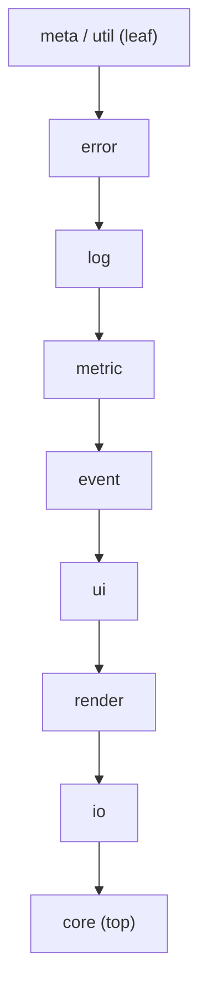
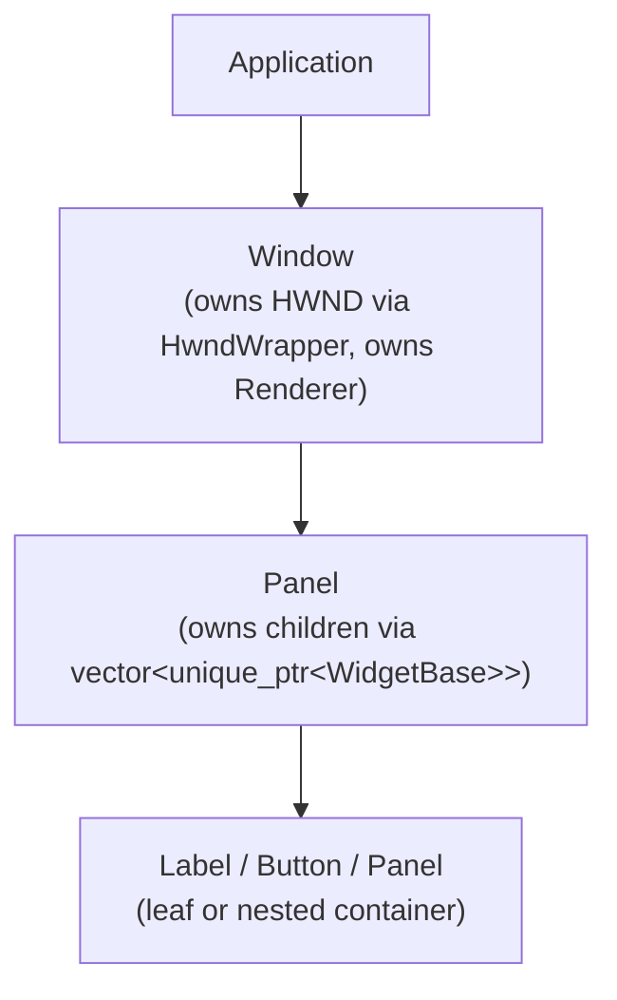

# Architecture

This document describes the high-level design of zketch: how the layers are organized, how components interact, and the key design decisions behind the framework.

---

## Overview

zketch is a single-threaded, Windows-only GUI framework built on Win32 API, Direct2D, and DirectWrite. It is designed around two core use cases:

- **Game Engine / Continuous Rendering** — a non-blocking message loop (`PeekMessage`) that runs every frame without waiting for input events.
- **Desktop Application / Event-Driven** — a blocking message loop (`GetMessage`) that sleeps the thread when idle, conserving CPU.

The framework is structured as a strict layered dependency graph. Higher layers depend on lower layers; no cyclic dependencies are permitted.

---

## Dependency Layers

Each layer maps to a namespace and a folder:

| Layer | Namespace | Folder |
|---|---|---|
| Utilities and metaprogramming | `zk::util`, `zk::meta` | `include/zk/util/` |
| Error handling | `zk::error` | `include/zk/error/` |
| Logging | `zk::log` | `include/zk/log/` |
| Metric types | `zk::metric` | `include/zk/metric/` |
| Event system | `zk::event` | `include/zk/event/` |
| Widget layer | `zk::ui` | `include/zk/ui/` |
| Rendering | `zk::render` | `include/zk/render/` |
| Serialization / deserialization | `zk::io` | `include/zk/io/` |
| Application and message loop | `zk::core` | `include/zk/core/` |

---

## Component Descriptions

### zk::util and zk::meta

The foundation layer. Contains:

- `Arithmetic` concept — constrains template parameters to arithmetic types (`std::is_arithmetic_v<T>`).
- `clamp()` — generic value clamping used throughout the metric layer.
- `arithmetic_op` — generic add, subtract, multiply, divide with type promotion.
- `NativeWrapper<Handle, Deleter>` — RAII wrapper for Win32 handles. Move-only; the deleter is called exactly once on destruction. `HwndWrapper` is a pre-defined alias for `NativeWrapper<HWND, &DestroyWindow>`.
- `enums.hpp` — `to_string()` overloads for all framework `enum class` types, and `to_underlying()` for explicit numeric conversion.

### zk::error

Structured error handling without exceptions.

- `ErrorCode` — `enum class` with 10 distinct codes covering initialization, window creation, rendering, parsing, and thread safety failures.
- `Error` — struct containing `code`, `message` (human-readable string), and `native_error` (Win32 `GetLastError()` or HRESULT).
- `is_fatal()` — returns true for unrecoverable errors (e.g., `WindowCreationFailed`, `RenderTargetCreationFailed`).
- `make_error()` and `make_win32_error()` — factory helpers.

All fallible public API returns `std::expected<T, zk::error::Error>`.

### zk::log

Structured logging with compile-time elimination.

- `Level` enum: `Trace`, `Debug`, `Info`, `Warn`, `Error`, `Fatal`.
- `Domain` enum: `Core`, `UI`, `Render`, `Event`, `IO`, `Parser`.
- `Logger` singleton with `set_min_level()`, `set_domain_filter()`, and `add_sink()`.
- The `log<Level, Domain>()` template method uses `if constexpr` to eliminate log calls at compile time when the level is below the threshold.
- `ZK_LOG(level, domain, msg)` macro captures `__FILE__` and `__LINE__` automatically.
- Sinks are `std::function<void(const LogEntry&)>` — any callable works (console, file, in-memory buffer for tests).

### zk::metric

Type-safe 2D coordinate and dimension types.

- `basic_pair<Derived>` — CRTP base class. Provides all arithmetic operators (`+`, `-`, `*`, `/`, `+=`, `-=`, `*=`, `/=`) via a single `apply()` method. Holds the `MAX` constant as the single source of truth for the upper bound.
- `Pos<T>` — 2D position `{x, y}`. Range: `[-MAX, MAX]`. Supports negative values for relative coordinates.
- `Size<T>` — 2D dimensions `{w, h}`. Range: `[0, MAX]`. Never negative.
- `Rect<T>` — flat rectangle `{x, y, w, h}` with `contains()`, `right()`, and `bottom()` helpers.
- All constructors clamp input values to the valid range automatically.

### zk::event

Callback-based event dispatch.

- `EventType` enum: `Click`, `Resize`, `Close`, `KeyDown`, `KeyUp`, `MouseEnter`, `MouseLeave`.
- Payload structs: `ClickPayload`, `ResizePayload`, `KeyPayload`, `ClosePayload`, `MouseEnterPayload`, `MouseLeavePayload`.
- `EventDispatcher` — stores handlers in a `std::array` indexed by `EventType` for O(1) lookup with no per-dispatch allocation. Supports multiple subscribers per event type. Returns a `HandlerId` for selective unsubscribe. Exceptions thrown by handlers are caught, logged, and swallowed — the application does not crash.
- All dispatch operations must run on the Main Thread. A thread-id assertion fires in debug builds if this contract is violated.

### zk::ui

The widget layer.

- `WidgetBase` — abstract base with `pos_`, `size_`, `visible_`, and `dirty_` fields. Declares the `render(Renderer&)` interface.
- `Window` — top-level Win32 window. Owns the `HWND` (via `HwndWrapper`), the `Renderer`, and a list of `Panel` children. The static `WndProc` translates Win32 messages (`WM_SIZE`, `WM_DESTROY`, `WM_KEYDOWN`, `WM_KEYUP`, `WM_MOUSEMOVE`, `WM_LBUTTONDOWN`, `WM_LBUTTONUP`) into `EventDispatcher` calls. Default size is 800x600 if not specified.
- `Panel` — container widget. Owns child widgets via `std::unique_ptr`. Maintains an `abs_pos_` (absolute screen coordinate) derived from its parent's absolute position plus its own relative position. Moving a Panel recursively updates all children's absolute positions.
- `Label` — static text widget. Configurable text, `FontConfig`, and `Color`. Marks itself dirty on any property change.
- `Button` — interactive widget with a state machine: `Normal`, `Hovered`, `Disabled`. Calls the registered click handler only when not `Disabled`. Missing handler is a no-op.

### zk::render

Direct2D rendering backend.

- `Renderer` — wraps `ID2D1Factory`, `ID2D1HwndRenderTarget`, and `IDWriteFactory` via `Microsoft::WRL::ComPtr`.
- Factory method `Renderer::create(HWND)` initializes all COM objects and returns `std::expected<Renderer, Error>`.
- Frame lifecycle: `begin_frame()` calls `BeginDraw`, draw calls follow, `end_frame()` calls `EndDraw`.
- If `EndDraw` returns `D2DERR_RECREATE_TARGET` (device loss), the render target is recreated automatically and `needs_redraw()` is set so the caller can schedule an immediate repaint.
- Draw primitives: `clear(Color)`, `draw_rect(Pos, Size, Color)`, `draw_text(string_view, Pos, Size, FontConfig, Color)`.
- Text is clipped to the widget's bounding `Size`.

### zk::io

Widget config serialization and deserialization.

- `WidgetSerializer::serialize(const Window&)` — converts a widget hierarchy to a human-readable indentation-based text format.
- `WidgetParser::parse(string_view)` — reconstructs a widget hierarchy from the text format. Returns `std::expected<unique_ptr<Window>, ParseError>`.
- `ParseError` carries a 1-based line number, column number, and a human-readable message.
- The format is round-trip stable: `serialize(parse(serialize(w))) == serialize(w)`.

### zk::core

The top-level application layer.

- `PumpMode` enum: `NonBlocking` (PeekMessage), `Blocking` (GetMessage).
- `Application` — single entry point. Registers the Win32 window class via `RegisterClassEx`. Factory method `Application::create(class_name, mode)` returns `std::expected<Application, Error>`. `run()` delegates to the appropriate pump.
- `NonBlockingPump` — drains all pending messages via `PeekMessage(PM_REMOVE)`, then calls the frame callback once per iteration. Designed for game loops.
- `BlockingPump` — calls `GetMessage` which blocks until a message arrives. No frame callback. Designed for desktop applications.
- `MainThreadQueue` — thread-safe queue (`std::mutex` + `std::queue`). Any thread can `post()` a callable; the main thread calls `flush()` each iteration to execute pending work.

---

## Widget Ownership Model

Ownership flows strictly downward:

`add_child()` and `add_panel()` transfer `unique_ptr` ownership into the parent. `remove_child()` returns ownership to the caller. There is no shared ownership.

---

## Coordinate System

- `Pos<int>` stores relative position (relative to the parent widget's top-left corner).
- `Panel` maintains `abs_pos_` — the absolute screen coordinate of its top-left corner.
- When a Panel is moved or reparented, it recursively recomputes `abs_pos_` for all children: `child_abs = clamp(parent_abs + child_rel, min=0)`.
- Absolute positions are never negative (clamped to 0).

---

## Thread Safety

zketch is single-threaded by design. All widget operations, message loop iterations, and event dispatch must occur on the Main Thread. In debug builds, a thread-id assertion fires immediately if this contract is violated. Cross-thread work must be posted via `MainThreadQueue::post()` and will be executed on the main thread during the next `flush()` call.

---

## Error Handling Strategy

No exceptions are used as control flow. Every fallible public API returns `std::expected<T, zk::error::Error>`. Callers check the result and handle errors explicitly. The `Error` struct carries a typed `ErrorCode`, a human-readable message, and the raw Win32 error code or HRESULT for diagnostic purposes.

---

## Build Targets

| Target | Type | Description |
|---|---|---|
| `zketch_core` | Interface library | Header-only metric and util layers |
| `zketch_core_impl` | Static library | Application, MessageLoop, Logger |
| `zketch_ui` | Static library | Window, Panel, Label, Button, EventDispatcher |
| `zketch_render` | Static library | Renderer (Direct2D backend) |
| `zketch_io` | Static library | WidgetSerializer, WidgetParser |
| `zketch` | Executable | Main application entry point |
| `example_hello_window` | Executable | Blocking mode example |
| `example_game_loop` | Executable | NonBlocking mode example |
| `test_*` | Executables | 16 test binaries (one per module) |
